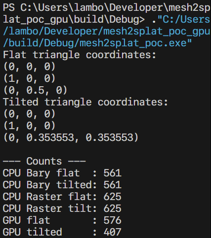
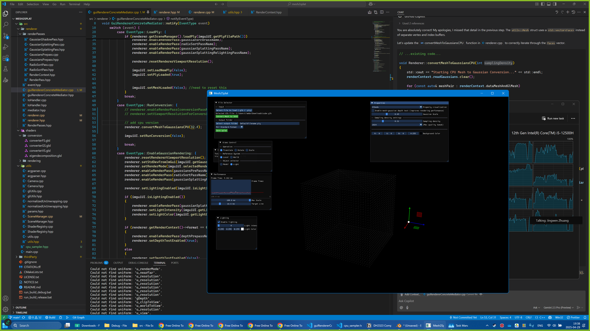
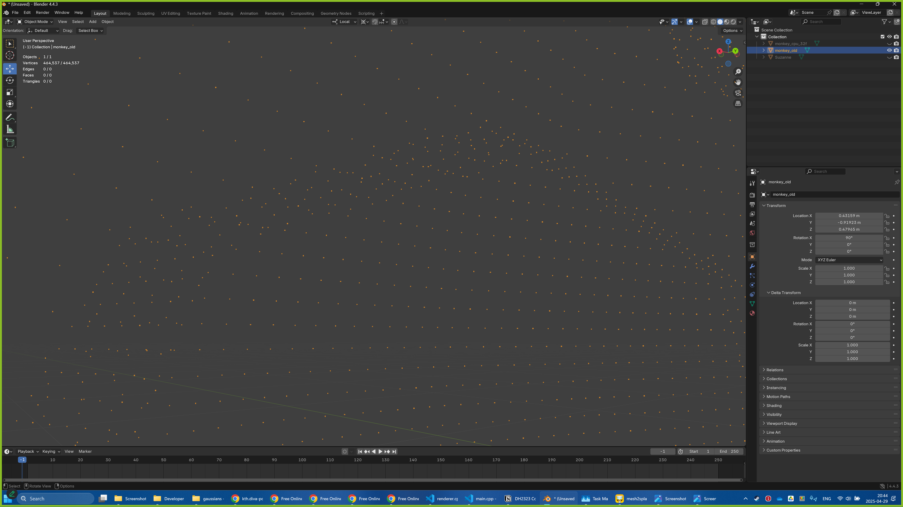
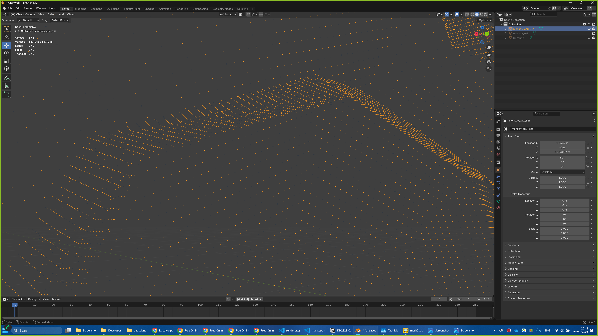
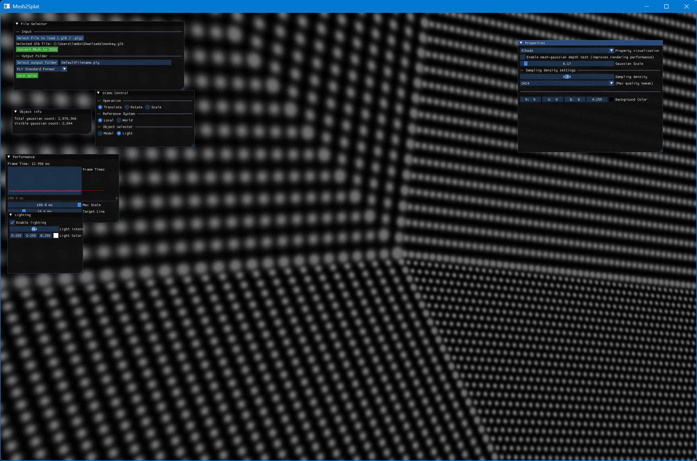
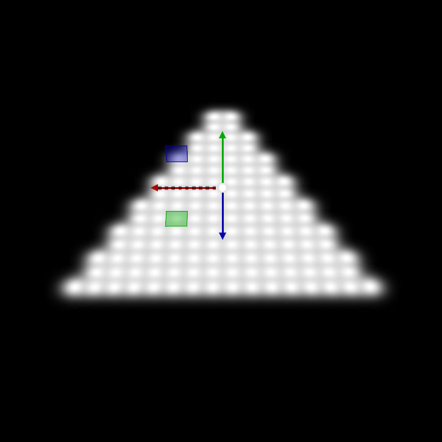
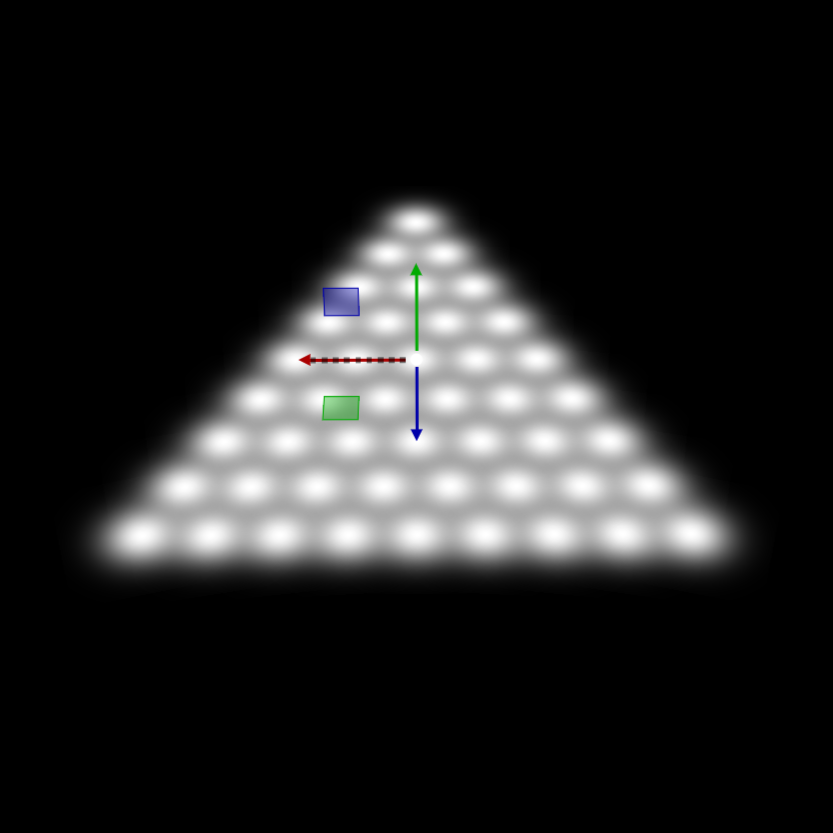
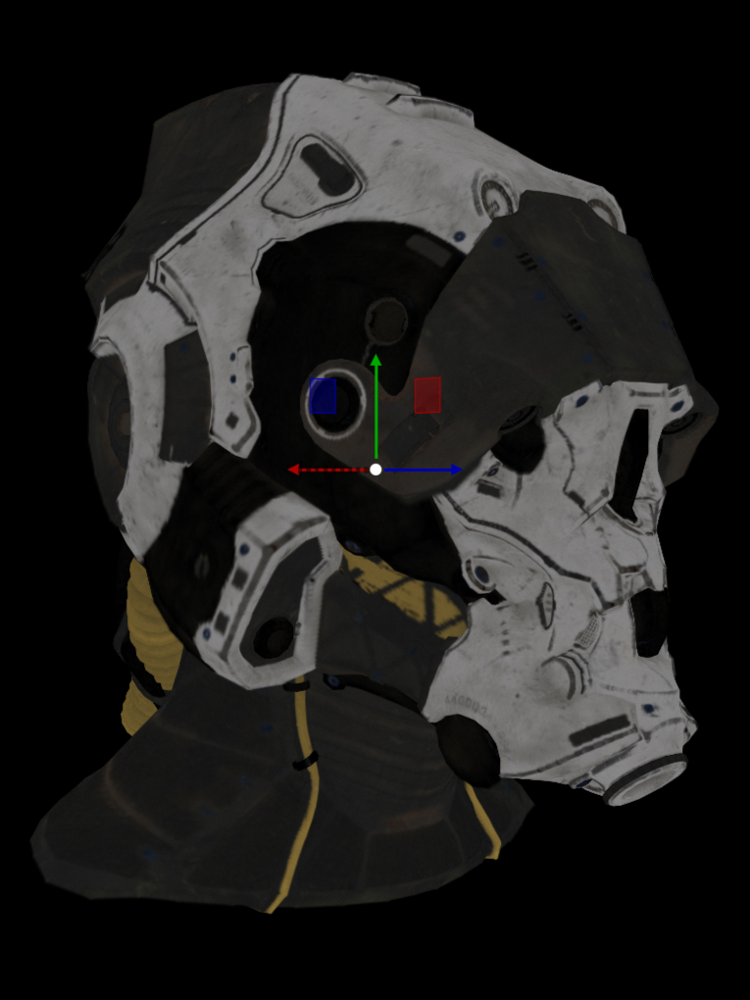
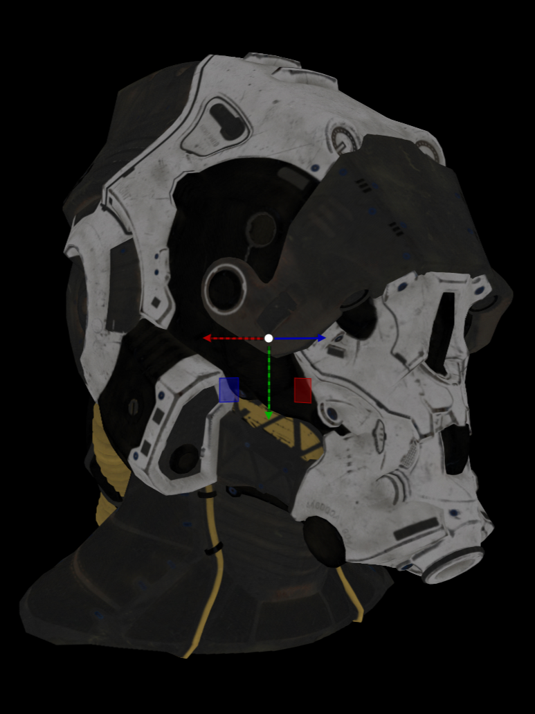

# Project Blog DH2323 - Computer Graphics and Interaction
We started this project with trying to figure out what we wanted to do. We were interested in Gaussian splatting from the moment we heard about it in the course, however, we did not really know the direction of the project until we went to Scolari’s lecture. Even though we got closer to a project scope, we had to change it while we were working on it.

## *2025 April 28* - POC
Before we implemented our solution we decided to experiment with 3D sampling in one of the rendering assignments, we thought that this would be easier since the program was smaller and did not need us to learn the Mesh2Splat implementation. 

We started with creating a proof of concept to see how sampling of a 3D triangle with vertices (Barycentric coordinates) could be implemented in an independent application. With the use of SDL and C++ an implementation testing sampling on two triangles, one "regular" and one rotated was created.

*Figure 1. Results from the first test.*

*Figure 2. We used the ImageToSTL Website to check the density of the rendered triangles in different tilted angles.*

### Thinking about Implementation on GPU
We wanted to try to implement this solution on the GPU. However, since we started with the project quite late and since we did not have much experience with GPU programming, we decided to do a CPU implementation and then check if it was feasible to implement it on the GPU later (it was not).

## *2025 April 30* - Implementation in Mesh2Splat repository

When we had a solution we wanted to implement, we started analysing the codebase of Mesh2Splat. We integrated our solution and the main functionality in renderer.cpp which handles the original rendering. The renderer-class’s new method convertMeshToGaussiansCPU was then used in the main pipeline instead of its original method convertMeshToGaussians. We also skipped the interpolation of materials at this point in order to see if our implementation would work without going too in-depth. The results can be seen in the upcoming screenshots.

*Figure 3. First  test using a cube.*

We later experimented on other models such as Blenders Sussan model. When comparing edges with the original Mesh2Splat method and our method you can see a difference.

*Figure 4. Original method (Blender’s Sussan model)*

*Figure 5. Our method (Blender’s Sussan model)*

## *2025 May 23* - Discussing implementation alternatives and which direction to go with the project.

This might look like a long step in time, and you are right! We had a lot to do in other courses, so we had to prioritize those projects instead. We did work on the report in the meantime and on the side discussed possible solutions to our project. We discussed which way we wanted to go with the project and how much we wanted to do on it (it was around this time we decided to only do the CPU version of the implementation).

## *2025 June 3* - Interpolate materials and other problems
We finalized the project around this time, we added interpolation of materials. We also tried out solutions for merging the overlapping gaussians for future work, but it would take the CPU too much time to find and merge all the gaussians for any complicated models with a large amount of triangles (O(N^2) time complexity). 

*Figure 6. Overlapping Gaussians on the edges.*

In the end we are happy with the results of the project. If we were to do it again, we would probably start sooner, though. 

Below are some of the final images and results from the project

*Figure 7. Old method (jagged edges)*

*Figure 8. Our method (less jagged edges)*

*Figure 9. Our method with a sampling density of 16 per triangle edge, Gaussian count: ~3.5M*

*Figure 10. Original Mesh2Splat with sampling density 1 in 1024x1024 resolution, Gaussian count: ~2.9M*